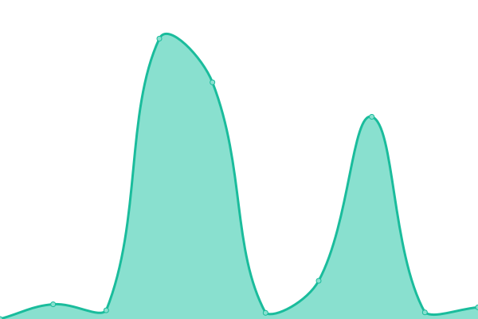
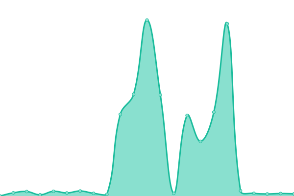
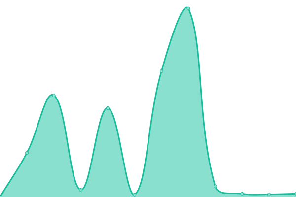

# [📈 Live Status](https://Data-Innova.github.io/monitoreo-fuentes): <!--live status--> **🟩 All systems operational**

This repository contains the open-source uptime monitor and status page for [Data Innova](www.datainnova.co), powered by [Upptime](https://github.com/upptime/upptime).

With [Upptime](https://upptime.js.org), you can get your own unlimited and free uptime monitor and status page, powered entirely by a GitHub repository. We use [Issues](https://github.com/Data-Innova/monitoreo-fuentes/issues) as incident reports, [Actions](https://github.com/Data-Innova/monitoreo-fuentes/actions) as uptime monitors, and [Pages](https://Data-Innova.github.io/monitoreo-fuentes) for the status page.

<!--start: status pages-->
<!-- This summary is generated by Upptime (https://github.com/upptime/upptime) -->
<!-- Do not edit this manually, your changes will be overwritten -->
<!-- prettier-ignore -->
| URL | Status | History | Response Time | Uptime |
| --- | ------ | ------- | ------------- | ------ |
|  [Buscadores - Noticias](https://buscadores.compliance.com.co/healthcheck) | 🟩 Up | [buscadores-noticias.yml](https://github.com/Data-Innova/monitoreo-fuentes/commits/HEAD/history/buscadores-noticias.yml) | 

 574ms
     
 | 

<a href="https://Data-Innova.github.io/monitoreo-fuentes/history/buscadores-noticias">100.00%</a>
    

|  [Certificar Backend](https://app.certificar.co/app/public/health) | 🟩 Up | [certificar-backend.yml](https://github.com/Data-Innova/monitoreo-fuentes/commits/HEAD/history/certificar-backend.yml) | 

 189ms
     
 | 

<a href="https://Data-Innova.github.io/monitoreo-fuentes/history/certificar-backend">100.00%</a>
    

|  [Certificar Frontend](https://app.certificar.co) | 🟩 Up | [certificar-frontend.yml](https://github.com/Data-Innova/monitoreo-fuentes/commits/HEAD/history/certificar-frontend.yml) | 

 34ms
     
 | 

<a href="https://Data-Innova.github.io/monitoreo-fuentes/history/certificar-frontend">100.00%</a>
    

|  [Colombia LN - Bogotá](http://colombia-ln-bogota.compliance.com.co/healthcheck) | 🟩 Up | [colombia-ln-bogota.yml](https://github.com/Data-Innova/monitoreo-fuentes/commits/HEAD/history/colombia-ln-bogota.yml) | 

 2893ms
     
 | 

<a href="https://Data-Innova.github.io/monitoreo-fuentes/history/colombia-ln-bogota">92.55%</a>
    

|  [Colombia LN - AWS Datainnova](https://colombia-ln.identidapp.com/healthcheck) | 🟩 Up | [colombia-ln-aws-datainnova.yml](https://github.com/Data-Innova/monitoreo-fuentes/commits/HEAD/history/colombia-ln-aws-datainnova.yml) | 

 466ms
     
 | 

<a href="https://Data-Innova.github.io/monitoreo-fuentes/history/colombia-ln-aws-datainnova">100.00%</a>
    

|  [Colombia LN](https://colombia-ln.compliance.com.co/healthcheck) | 🟩 Up | [colombia-ln.yml](https://github.com/Data-Innova/monitoreo-fuentes/commits/HEAD/history/colombia-ln.yml) | 

 10390ms
     
 | 

<a href="https://Data-Innova.github.io/monitoreo-fuentes/history/colombia-ln">52.32%</a>
    

|  [Colombia Información General](https://colombia-ig.compliance.com.co/healthcheck) | 🟩 Up | [colombia-informacion-general.yml](https://github.com/Data-Innova/monitoreo-fuentes/commits/HEAD/history/colombia-informacion-general.yml) | 

 437ms
     
 | 

<a href="https://Data-Innova.github.io/monitoreo-fuentes/history/colombia-informacion-general">100.00%</a>
    

|  [Compliance/Datariesgos - Instances Batch](https://app.compliance.com.co/validador/healthBatch/healthChecks/health) | 🟩 Up | [compliance-datariesgos-instances-batch.yml](https://github.com/Data-Innova/monitoreo-fuentes/commits/HEAD/history/compliance-datariesgos-instances-batch.yml) | 

 885ms
     
 | 

<a href="https://Data-Innova.github.io/monitoreo-fuentes/history/compliance-datariesgos-instances-batch">99.79%</a>
    

|  [Compliance/Datariesgos - Instances Web](https://app.compliance.com.co/validador/apiPublica/healthChecks) | 🟩 Up | [compliance-datariesgos-instances-web.yml](https://github.com/Data-Innova/monitoreo-fuentes/commits/HEAD/history/compliance-datariesgos-instances-web.yml) | 

 34ms
     
 | 

<a href="https://Data-Innova.github.io/monitoreo-fuentes/history/compliance-datariesgos-instances-web">100.00%</a>
    

|  [Compliance/Datariesgos - Instances WebService](https://app.compliance.com.co/validador/healthWs/healthChecks) | 🟩 Up | [compliance-datariesgos-instances-web-service.yml](https://github.com/Data-Innova/monitoreo-fuentes/commits/HEAD/history/compliance-datariesgos-instances-web-service.yml) | 

 34ms
     
 | 

<a href="https://Data-Innova.github.io/monitoreo-fuentes/history/compliance-datariesgos-instances-web-service">100.00%</a>
    

|  [Extractor - Nodejs](https://extractor.compliance.com.co/healthcheck) | 🟩 Up | [extractor-nodejs.yml](https://github.com/Data-Innova/monitoreo-fuentes/commits/HEAD/history/extractor-nodejs.yml) | 

 1052ms
     
 | 

<a href="https://Data-Innova.github.io/monitoreo-fuentes/history/extractor-nodejs">100.00%</a>
    

|  [Extractor Nombres](https://nombres.compliance.com.co/healthcheck) | 🟩 Up | [extractor-nombres.yml](https://github.com/Data-Innova/monitoreo-fuentes/commits/HEAD/history/extractor-nombres.yml) | 

 927ms
     
 | 

<a href="https://Data-Innova.github.io/monitoreo-fuentes/history/extractor-nombres">100.00%</a>
    

|  [Fabrica de Captcas](https://captcha.compliance.com.co/captcha-service-health-check) | 🟩 Up | [fabrica-de-captcas.yml](https://github.com/Data-Innova/monitoreo-fuentes/commits/HEAD/history/fabrica-de-captcas.yml) | 

 154ms
     
 | 

<a href="https://Data-Innova.github.io/monitoreo-fuentes/history/fabrica-de-captcas">100.00%</a>
    

|  [Fabrica de Nombres](https://fabricanombre.compliance.com.co/actuator/health) | 🟩 Up | [fabrica-de-nombres.yml](https://github.com/Data-Innova/monitoreo-fuentes/commits/HEAD/history/fabrica-de-nombres.yml) | 

 202ms
     
 | 

<a href="https://Data-Innova.github.io/monitoreo-fuentes/history/fabrica-de-nombres">100.00%</a>
    

|  [Fuentes Ecuador](https://ecuador.compliance.com.co/healthcheck) | 🟩 Up | [fuentes-ecuador.yml](https://github.com/Data-Innova/monitoreo-fuentes/commits/HEAD/history/fuentes-ecuador.yml) | 

 563ms
     
 | 

<a href="https://Data-Innova.github.io/monitoreo-fuentes/history/fuentes-ecuador">100.00%</a>
    

|  [Fuentes Mexico](http://mexico.compliance.com.co/healthcheck) | 🟩 Up | [fuentes-mexico.yml](https://github.com/Data-Innova/monitoreo-fuentes/commits/HEAD/history/fuentes-mexico.yml) | 

 317ms
     
 | 

<a href="https://Data-Innova.github.io/monitoreo-fuentes/history/fuentes-mexico">100.00%</a>
    

|  [Fuentes Perú](https://peru-fuentes.compliance.com.co/healthcheck) | 🟩 Up | [fuentes-peru.yml](https://github.com/Data-Innova/monitoreo-fuentes/commits/HEAD/history/fuentes-peru.yml) | 

 430ms
     
 | 

<a href="https://Data-Innova.github.io/monitoreo-fuentes/history/fuentes-peru">100.00%</a>
    

|  [Identidapp Backend](https://app.identidapp.com/ApiPublica/Welcome/helloWorld) | 🟩 Up | [identidapp-backend.yml](https://github.com/Data-Innova/monitoreo-fuentes/commits/HEAD/history/identidapp-backend.yml) | 

 223ms
     
 | 

<a href="https://Data-Innova.github.io/monitoreo-fuentes/history/identidapp-backend">100.00%</a>
    

|  [Identidapp Frontend](https://app.identidapp.com/) | 🟩 Up | [identidapp-frontend.yml](https://github.com/Data-Innova/monitoreo-fuentes/commits/HEAD/history/identidapp-frontend.yml) | 

 72ms
     
 | 

<a href="https://Data-Innova.github.io/monitoreo-fuentes/history/identidapp-frontend">100.00%</a>
    

|  [Listas Internacionales - Nodejs](https://listas-internacionales.compliance.com.co/healthcheck) | 🟩 Up | [listas-internacionales-nodejs.yml](https://github.com/Data-Innova/monitoreo-fuentes/commits/HEAD/history/listas-internacionales-nodejs.yml) | 

 6375ms
     
 | 

<a href="https://Data-Innova.github.io/monitoreo-fuentes/history/listas-internacionales-nodejs">96.05%</a>
    

|  [Listas Internacionales - Nodejs - AWS Datainnova](https://listas-internacionales.identidapp.com/healthcheck) | 🟩 Up | [listas-internacionales-nodejs-aws-datainnova.yml](https://github.com/Data-Innova/monitoreo-fuentes/commits/HEAD/history/listas-internacionales-nodejs-aws-datainnova.yml) | 

 444ms
     
 | 

<a href="https://Data-Innova.github.io/monitoreo-fuentes/history/listas-internacionales-nodejs-aws-datainnova">100.00%</a>
    

|  [Liveness IDentidapp](https://liveness.identidapp.com/) | 🟩 Up | [liveness-i-dentidapp.yml](https://github.com/Data-Innova/monitoreo-fuentes/commits/HEAD/history/liveness-i-dentidapp.yml) | 

 223ms
     
 | 

<a href="https://Data-Innova.github.io/monitoreo-fuentes/history/liveness-i-dentidapp">100.00%</a>
    

|  [Servidor Ecuador - Nodejs](http://38.165.231.40:5000/healthcheck) | 🟩 Up | [servidor-ecuador-nodejs.yml](https://github.com/Data-Innova/monitoreo-fuentes/commits/HEAD/history/servidor-ecuador-nodejs.yml) | 

 569ms
     
 | 

<a href="https://Data-Innova.github.io/monitoreo-fuentes/history/servidor-ecuador-nodejs">100.00%</a>
    

|  [Siri - Nodejs](https://siri.compliance.com.co/healthcheck) | 🟩 Up | [siri-nodejs.yml](https://github.com/Data-Innova/monitoreo-fuentes/commits/HEAD/history/siri-nodejs.yml) | 

 3982ms
     
 | 

<a href="https://Data-Innova.github.io/monitoreo-fuentes/history/siri-nodejs">99.55%</a>
    

<!--end: status pages-->

[**Visit our status website →**](https://Data-Innova.github.io/monitoreo-fuentes)

## 📄 License

- Powered by: [Upptime](https://github.com/upptime/upptime)
- Code: [MIT](./LICENSE) © [Anand Chowdhary](https://anandchowdhary.com), supported by [Pabio](https://pabio.com)
- Data in the `./history` directory: [Open Database License](https://opendatacommons.org/licenses/odbl/1-0/)
